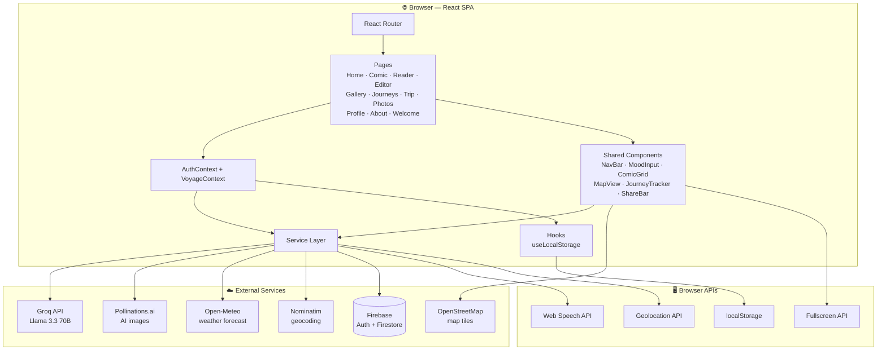
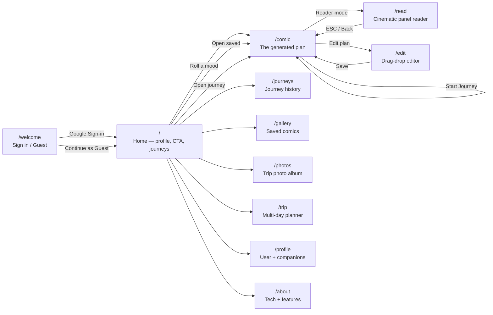
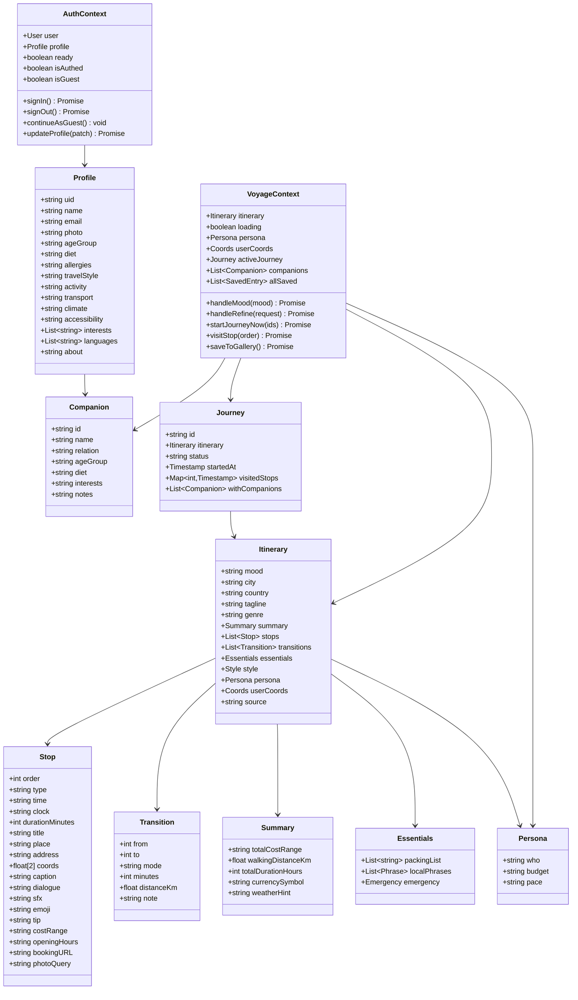
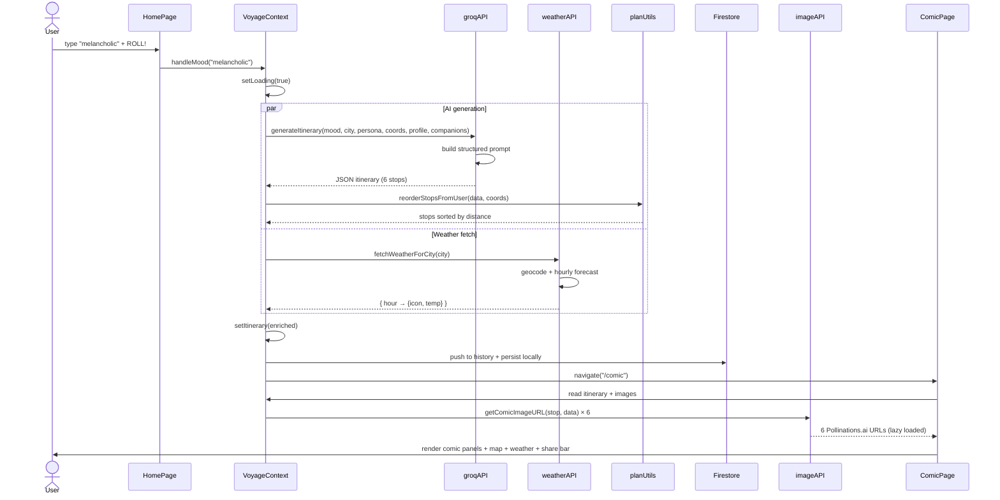
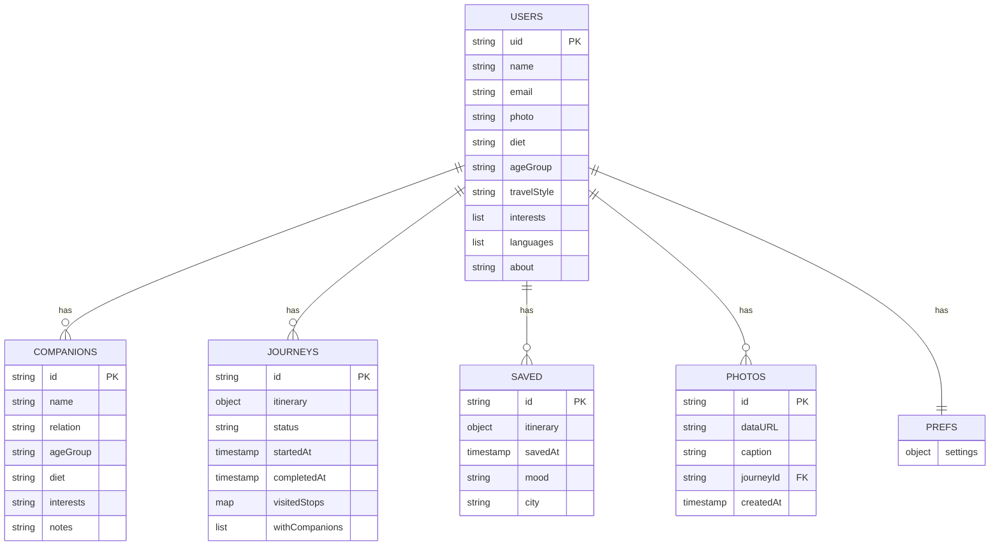
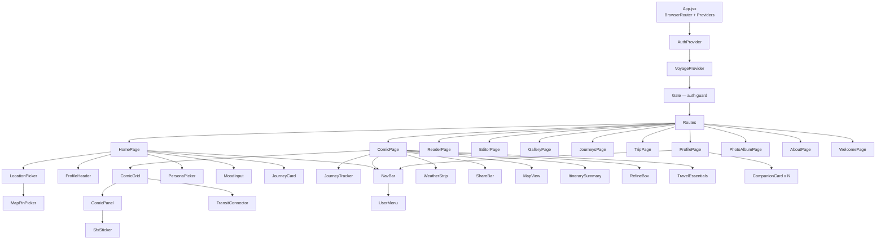

<<<<<<< HEAD
# VOYAGE — Roll. Commit. Ship.

> A mood-based 1-day travel planner that renders your day as a **comic book**. Speak a mood → get a 6-stop itinerary with AI-generated panels, real maps, weather forecasts, companions, voice narration, and cloud-synced journey tracking.

---
# Voyage

Live Demo: https://voyage-sable.vercel.app

A mood-based 1-day travel planner rendered as a comic book.
## 🚀 Quick Start

```bash
npm install
npm run dev
```

Open http://localhost:5173

### Add your keys to `.env.local`

```bash
# Groq (required for real AI — otherwise falls back to canned data)
VITE_GROQ_API_KEY=gsk_...

# Firebase (optional — enables login + cloud sync; app works fully without it)
VITE_FIREBASE_API_KEY=AIza...
VITE_FIREBASE_AUTH_DOMAIN=your-proj.firebaseapp.com
VITE_FIREBASE_PROJECT_ID=your-proj
VITE_FIREBASE_STORAGE_BUCKET=your-proj.appspot.com
VITE_FIREBASE_MESSAGING_SENDER_ID=...
VITE_FIREBASE_APP_ID=...
```

---

## 🏛️ System Architecture

The app is a pure frontend SPA (React + Vite). All "backend" responsibilities are pushed to Firebase (auth + data) or free public APIs (AI, weather, maps, geocoding, images). No custom server.



---

## 🗺️ Page & Route Map



---

## 🧩 Class Diagram — State & Data Model



---

## 🔁 Sequence Diagram — "Generate a Plan"

The most important flow. From user tapping **ROLL!** to the comic rendering on screen.



---

## 🗃️ Firestore Data Model



---

## 🏗️ Component Hierarchy



---

## 🧠 How the AI Plan Is Personalized

1. **User inputs:** mood word + city
2. **Session state:** persona (solo/couple/family + budget + pace) + starting coordinates
3. **Profile (if signed in):** diet, allergies, age, interests, languages, travel style, activity level, accessibility, "about me"
4. **Companions:** each companion's diet, age, relation, interests, notes
5. **System prompt to Groq enforces:**
   - *"Dietary restrictions are non-negotiable"* across all members
   - *"Stop #1 must be within 2 km of the starting coordinates"*
   - *"Pace = chill/balanced/packed → adjust stop count"*
   - Match the mood's tone (noir for sad, action for hyper, etc.)
6. **Post-processing** (`planUtils.reorderStopsFromUser`) runs a **nearest-neighbor sort** on the stops so #1 is closest to the user, then each next stop is closest to the previous — guarantees a sensible route even if the LLM's ordering was suboptimal.

---

## 📦 Tech Stack

| Layer | Tech | Why |
|---|---|---|
| UI | React 18 + Vite | Fast HMR, minimal config |
| Routing | React Router v7 | Real URLs per page |
| Styling | Tailwind CSS | Custom comic-book theme via utility classes |
| Animation | Framer Motion | Page + panel transitions |
| Drag-drop | @dnd-kit | Plan Editor reorder |
| Map | Leaflet + react-leaflet + OpenStreetMap | Free tiles, custom comic pins |
| LLM | Groq (Llama 3.3 70B) | Fastest JSON-mode LLM |
| Images | Pollinations.ai | Free AI comic image generation |
| Weather | Open-Meteo | Free hourly forecast, no key |
| Geocoding | Nominatim / OpenStreetMap | Free reverse + forward geocoding |
| Voice | Web Speech API | Browser-native TTS + STT |
| Auth | Firebase Auth (Google) | Google sign-in in one call |
| Data | Firestore | Cloud-synced saves, profile, journeys, photos |
| Export | html2canvas + custom ICS builder | PNG + calendar export |

---

## ⚡ Feature Summary

| Feature | Description |
|---|---|
| 🤖 Mood → Comic | One word becomes a 6-stop day with dialogue, SFX, and panels |
| 🗺️ Live map | Leaflet route with numbered pins, YOU pulse-marker, fullscreen |
| 📍 Smart start | GPS · typed city · map pin — plan always starts within 2 km of you |
| 👥 Personas & Companions | AI plans respect diet, age, interests, budget, pace for everyone |
| 🎙️ Voice mode | Speak a mood · hear the comic narrated aloud |
| 🌦️ Weather-aware | Open-Meteo hourly forecast badged on each panel |
| 🧭 Journey tracking | Start a journey · mark stops visited · completed/abandoned history |
| 📸 Photo album | Upload real trip photos, linked to journeys, stored privately |
| 💾 Gallery | Save favourite plans, synced to your Google account |
| 🛠️ AI Refine | *"Make it cheaper"* or *"add a dessert stop"* — AI rewrites intelligently |
| ✏️ Drag-drop editor | Reorder stops, edit inline, auto-optimize by distance |
| 🎬 Cinematic Reader | One panel at a time · keyboard nav · auto-advance · narration |
| 🗓️ Multi-day Trip | Plan 2/3/5/7 days with a different mood per day |
| 📅 Export | Calendar (.ics), Google Maps route, share URL, PDF/PNG |

---

## 📁 Project Structure

```
src/
├── App.jsx                          # Router + Providers + Gate
├── main.jsx                         # React entry
├── context/
│   ├── AuthContext.jsx              # Firebase auth + profile state
│   └── VoyageContext.jsx            # Itinerary, persona, journeys, companions
├── pages/
│   ├── WelcomePage.jsx              # Landing + sign-in / guest
│   ├── HomePage.jsx                 # Main hub with mood + journeys
│   ├── ComicPage.jsx                # Rendered plan with all widgets
│   ├── ReaderPage.jsx               # Cinematic one-panel reader
│   ├── EditorPage.jsx               # Drag-drop plan editor
│   ├── GalleryPage.jsx              # Saved plans
│   ├── JourneysPage.jsx             # Journey history
│   ├── TripPage.jsx                 # Multi-day planner
│   ├── PhotoAlbumPage.jsx           # Real trip photos
│   ├── ProfilePage.jsx              # User + companions editor
│   └── AboutPage.jsx                # Features + stack
├── components/
│   ├── NavBar.jsx + UserMenu.jsx    # Top navigation
│   ├── MoodInput.jsx                # Mood text/voice/chips
│   ├── PersonaPicker.jsx            # Who/budget/pace
│   ├── LocationPicker.jsx           # Quick/type/GPS/pin
│   ├── MapPinPicker.jsx             # Drag-a-pin map picker
│   ├── ComicGrid.jsx + ComicPanel.jsx
│   ├── TransitConnector.jsx         # Walk/metro between stops
│   ├── SfxSticker.jsx               # POW/BAM/SIGH starbursts
│   ├── WeatherStrip.jsx             # Hourly forecast row
│   ├── MapView.jsx                  # Leaflet route map
│   ├── ItinerarySummary.jsx         # Timeline + running cost
│   ├── TravelEssentials.jsx         # Packing list + phrases + emergency
│   ├── ShareBar.jsx                 # Print/ICS/PNG/link
│   ├── RefineBox.jsx                # AI refinement input
│   ├── JourneyTracker.jsx           # Start + track progress
│   ├── JourneyCard.jsx              # Journey history card
│   ├── VoiceToggle.jsx              # Voice mode switch
│   └── PageTransition.jsx           # Framer motion wrapper
├── services/
│   ├── groqAPI.js                   # Plan generation + refinement
│   ├── voiceService.js              # Web Speech API wrapper
│   ├── weatherAPI.js                # Open-Meteo client
│   ├── imageAPI.js                  # Pollinations image URLs
│   ├── locationAPI.js               # Nominatim + geolocation
│   ├── exportService.js             # ICS, PNG, Google Maps, share URL
│   ├── planUtils.js                 # Distance-based stop reorder
│   ├── imageUtils.js                # File → resized base64
│   ├── firebase.js                  # Firebase init (graceful fallback)
│   ├── authService.js               # Google sign-in wrapper
│   ├── dbService.js                 # Saved comics CRUD
│   ├── profileService.js            # Profile + companions + journeys CRUD
│   └── photoService.js              # Photo album CRUD
├── hooks/
│   └── useLocalStorage.js           # Persisted state hook
├── data/
│   ├── moodPresets.js               # Mood → palette + SFX + genre
│   └── fallbackData.js              # 9 demo itineraries (no-key mode)
└── styles/
    └── comic.css                    # Halftones, bubbles, animations
```

---

## 🏆 Judging Criteria Mapping

| Criterion | How the app earns it |
|---|---|
| **Challenge completion** | Mood generator ✓ · Comic theme ✓ · Voice mode ✓ · Real travel plan (6 stops, map, cost, transit) ✓ |
| **Creativity & interpretation** | Mood → genre shift (noir/action/romance). The day IS a comic, not *has* a comic. Weather + AI images + narrator voice align with mood. |
| **Technical execution** | Structured LLM JSON, post-processed route optimization, real-time Firestore sync, Web Speech bi-directional, Leaflet + OpenStreetMap, live weather, graceful fallbacks everywhere |
| **Design & theme alignment** | Every page uses halftones, thick black borders, Bangers + Comic Neue fonts, speech bubbles, SFX starbursts. Comic is the metaphor, not the veneer. |

---

## 🔐 Security Notes

- Firebase web config is **public by design** — real security comes from **Firestore rules** + API key domain restrictions.
- The project is currently in **Firestore test mode** (open reads/writes for 30 days). For production, tighten rules to `request.auth.uid == resource.data.owner`.
- Groq key is loaded at build time via Vite (`VITE_*` prefix). For production, proxy through a server so the key isn't in the client bundle.

---

## 📝 License

Built for a 3-hour hackathon. Roll. Commit. Ship.
=======
# Voyage
An web Application where you could just say your mood and it plan one day travel plan for you which is full customized with all features
>>>>>>> 11fc0c850f78449b7b44513a8d84f790ffeccafc
